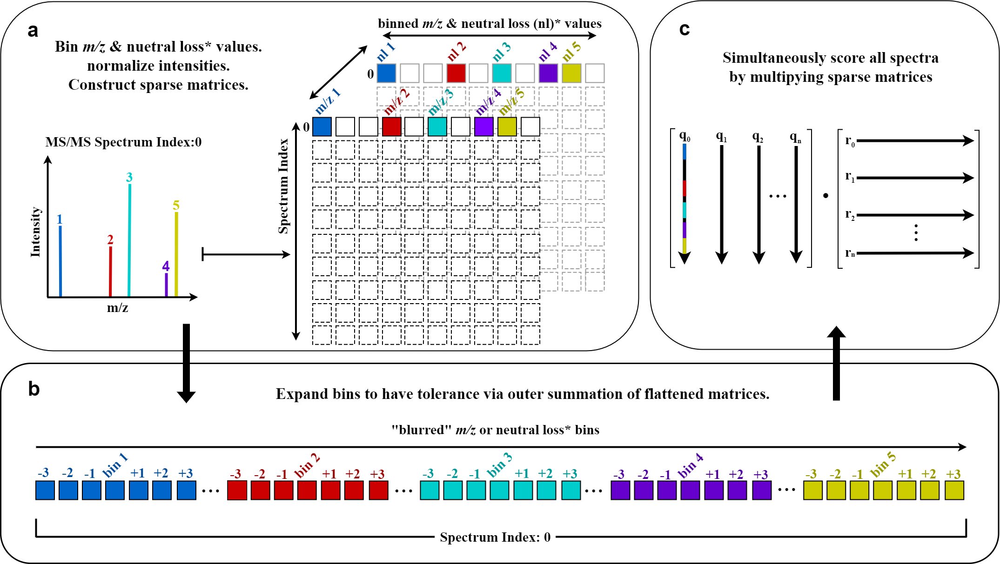

# BLINK

BLINK (Blur-and-Link) is a Python package for efficiently
generating cosine-based similarity scores and matching ion counts for large numbers of fragmentation mass spectra. Additionally, BLINK contains experimental features that can be used for molecular networking with allowances for combinatorial mass differences.  



## Installation

Use the package manager [conda](https://docs.conda.io/projects/conda/en/latest/user-guide/index.html) to install environment.yml for all BLINK and example notebook requirements.

```bash
conda env create -f environment.yml
```

[](https://mybinder.org/v2/gh/biorack/blink/HEAD)

## Base Python dependencies
- python3
- numpy
- scipy
- pandas
- pyteomics
- pymzml
- networkx

## Getting Started

```
Please see for descriptions and usage of primary functions and all optional parameters 
tutorial/blink_tutorial.ipynb
```

## Command-line Usage

```bash
>> ./blink.py --help
usage: blink.py [-h] [--trim] [--dedup] [-b B] [-i I] [-t T] [-d [D ...]] [-r R] [-s S] [-m M] [--fast_format] [-f] [-o O] F [F ...]

BLINK discretizes mass spectra (given .mgf inputs), and scores discretized spectra (given .npz inputs)

positional arguments:
  F                     files to process

optional arguments:
  -h, --help            show this help message and exit

  --trim                remove empty spectra when discretizing
  --dedup               deduplicate fragment ions within 2 times bin_width
  -b B, --bin_width B   width of bins in mz
  -i I, --intensity_power I
                        power to raise intensites to in when scoring

  -t T, --tolerance T   maximum tolerance in mz for fragment ions to match
  -d [D ...], --mass_diffs [D ...]
                        mass diffs to network
  -r R, --react_steps R
                        recursively combine mass_diffs within number of reaction steps
  -s S, --min_score S   minimum score to include in output
  -m M, --min_matches M
                        minimum matches to include in output

  --fast_format         use fast .npz format to store scores instead of .tab
  -f, --force           force file(s) to be remade if they exist
  -o O, --out_dir O     change output location for output file(s)


# Discretize fragmentation mass spectra to sparse matrix format (.npz)
# small = 1e2 spectra, medium = 1e4 spectra
>> blink.py ./example/small.mgf
small.npz
>> blink.py ./example/medium.mgf
medium.npz

# Compute all-by-all cosine scores and # matching ions for each fragmentation mass spectrum
>> blink.py ./example/small.npz
small.tab

# Compute A-vs-B cosine scores and # matching ions for each fragmentation mass spectrum
>> blink.py ./example/small.npz ./example/medium.npz
small_medium.tab
```

## Contributing
Pull requests are welcome.

For major changes, please open an issue first to discuss what you would like to change.
